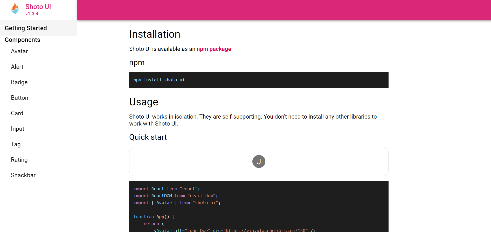
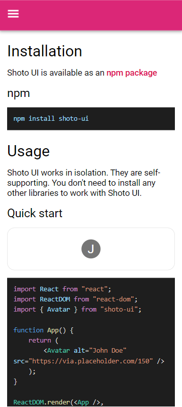
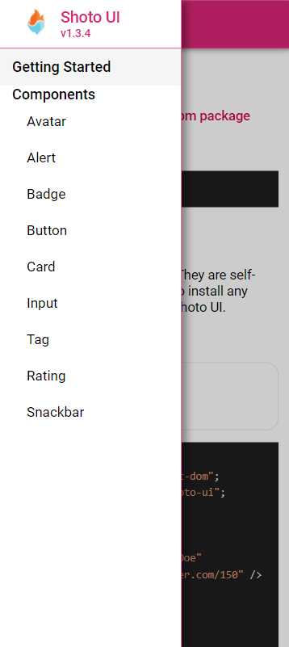

# Shoto UI Docs

This is the documentation site for Shoto UI - React Component Library, you can find the installation and usage instructions for Shoto UI here.

Live link: https://shotoui.netlify.app

Shoto UI Source Repo: https://github.com/OmkarArora/shoto-ui

---

## Components

- Avatar
- Alert
- Badge
- Button
- Card
- Input
- Tag
- Rating
- Snackbar

---

## Screenshots

### Desktop

### Mobile

<table align="center">
  <tr>
    <td></td>
    <td></td>
  </tr>
 </table>
